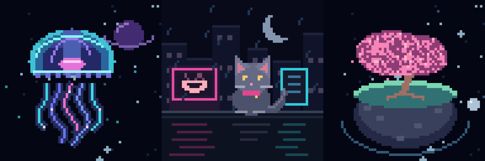

# 64 pixels, three little worlds

Three original, code-generated pixel animations for a 64×64 RGB LED matrix.
The submission GIFs were encoded with [Jixoo](https://github.com/glaforge/jixoo)'s
`GifEncoder` from procedurally drawn RGB frames. No third-party artwork, AI image
generation service, fonts, or API keys are needed.



| Artwork | Upload | Size | Loop |
| --- | --- | --- | --- |
| Cosmic Jellyfish | [GIF](submissions/01-cosmic-jellyfish.gif) | 71,233 bytes | 7.68 seconds |
| Neon Rain / Rooftop Cat | [GIF](submissions/02-neon-cat.gif) | 79,828 bytes | 7.68 seconds |
| Orbital Seasons | [GIF](submissions/03-orbital-seasons.gif) | 59,311 bytes | 7.68 seconds |

Each final file is **64×64, square, 96 frames, 80ms per frame, infinitely looping,
and below 5 MB**. The enlarged previews are for viewing only.

## 応募する

1. `preview.html` を開いて3作品を確認する。
2. 応募フォームのファイル欄で `submissions` 内の3つのGIFを選ぶ。
3. コードも応募する場合は、このフォルダのコードと成果物を自分のGitHubまたはGitLabリポジトリに公開する。
4. フォームの Code Repository URL 欄には **自分が公開したリポジトリのURL** を貼る。
   `https://github.com/glaforge/jixoo` はライブラリの参考URLなので、自分の作品のURLとしては使わない。
5. スクリーンショットに写っていない応募資格、期限、同意事項などを応募ページで確認して送信する。

GitHubなら空のPublicリポジトリ（例：`led-little-worlds`）を作り、
「uploading an existing file」または「Add file → Upload files」で、このフォルダの中身をアップロードする。
ZIPそのものを置くのではなく、展開したコードとフォルダを置く。
`work` と `.git` はアップロード不要。

## Reproduce

Python 3.10+ and Pillow are needed to draw the frames:

```sh
python -m pip install -r requirements.txt
python generate.py
python verify.py
```

This short path creates visually identical GIFs with Pillow. To reproduce the
submitted GIF encoding with the original Jixoo codec on Windows, install Java
17+ for the selected codec classes, Maven, Git, and Python, then run:

```powershell
./build-jixoo.ps1
# Or pass the path to a Python executable:
./build-jixoo.ps1 -Python 'C:/path/to/python.exe'
```

The script pins Jixoo commit `2703d703d7db530a74555b403f3a4a39f6383b55`,
compiles its ten unchanged image codec/model classes, and uses `JixooExport.java`
to encode the 64×64 raw RGB frames. It downloads `pngj` from Maven Central.
The **full Jixoo library and CLI require Java 21+**; this submission uses only
its image codec. No Jixoo sources are redistributed in this repository.

## Validation

`verify.py` checks dimensions, the 5 MB limit, timing, infinite playback, distinct
frames, and the transition from the last frame to the first. When RGB intermediate
files exist, it compares every decoded frame to its original source. The final
Jixoo GIFs passed with **zero RGB pixel error**. Details are in `validation.json`.
Physical Pixoo hardware playback has not been tested.

## Credits

- Artwork and procedural animation: original work in `generate.py`.
- GIF encoding: [Jixoo / glaforge](https://github.com/glaforge/jixoo), Apache-2.0.
- Drawing and independent GIF validation: [Pillow](https://python-pillow.org/).

Original code is available under the MIT license. Original artwork may be used,
modified, and submitted with the project. Third-party tools keep their own licenses.
